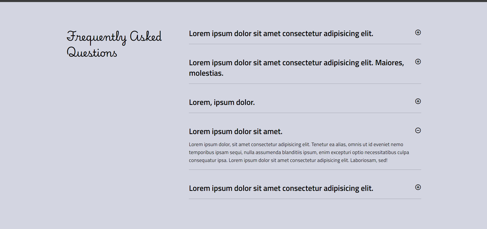

# React Accordion Component

This project demonstrates a basic accordion component built using React. The accordion allows users to expand and collapse sections of content, providing an efficient way to organize and display information.

## Features

- Expandable/collapsible sections
- Lightweight and easy to integrate

## Screenshot

## Installation

1. Clone the repository
2. Run `npm install` to install dependencies
3. Start the development server with `npm run dev`
